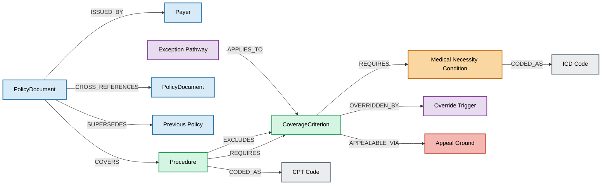

# Payer Policy KG — Entity-Relationship Diagram

*ScholarAgent · docs/er-diagram.md*

This diagram is the visual companion to the schema vocabulary in
[`DOMAIN.md`](DOMAIN.md) and the enforced constraints in
[`schema.cypher`](../schema.cypher). All three must agree.

## Reading the diagram

The diagram is laid out as the **conditional-traversal spine** the thesis is
built on: Payer → PolicyDocument → Procedure → CoverageCriterion → the four
typed leaf roles (MedicalNecessityCondition, ExceptionPathway, OverrideTrigger,
AppealGround). Color groups the layers — policy (blue), coverage (green),
clinical (orange), exception/override (purple), appeal (red), vocabulary (grey).

**`OVERRIDDEN_BY` and `CROSS_REFERENCES`** are the two edges the thesis predicts
flat RAG will miss — they live in cross-references and separate provisions in the
source documents, not adjacent to the criterion they modify. They are the
failure seams the KG exists to make traversable.

**Criterion → procedure traversal** is not drawn as a separate edge. Neo4j
traverses `(Procedure)-[:REQUIRES]->(CoverageCriterion)` bidirectionally, so the
reverse direction is already navigable without a materialized inverse edge
(see ADR-003).
